# SDD-Crash-Course: The Hands-On Playground for Context-Driven & Spec-Driven Development

> **100% Hands-On, Self-Diagnosing Interactive Scenarios Playground**  
> **Core Stack:** [Conductor](https://github.com/gemini-cli-extensions/conductor) + [OpenSpec (`@fission-ai/openspec`)](https://github.com/Fission-AI/OpenSpec) + `SPEC.md` (Single Source of Truth)  
> **License:** Apache 2.0  

---

## 1. Welcome to `SDD-Crash-Course`

**`SDD-Crash-Course`** is a self-contained, executable hands-on playground for learning and teaching **Context-Driven Development (CDD)** and **Spec-Driven Development (SDD)** using **Conductor** and **OpenSpec** together.

Instead of reading abstract slides, you will work through **6 self-contained, executable engineering scenarios**. Every scenario folder contains:
1. **`WALKTHROUGH.md`**: Step-by-step interactive instructions giving you **three ways to run every step**:
   - **Natural Speech Prompts** (paste directly into any AI coding assistant)
   - **Conductor Slash Commands** (`/conductor:setup`, `/conductor:newTrack`, `/conductor:implement`, `/conductor:review`, `/conductor:revert`)
   - **OpenSpec Skills & CLI Commands** (`/opsx:explore`, `/opsx:propose`, `/opsx:apply`, `/opsx:verify`, `/opsx:archive`, `openspec validate --strict`)
2. **Real Starting Code, Proposals, Bugged Services & Staged Patches**: Realistic distributed-systems and backend components in Python 3 (zero external cloud accounts or paid databases required—runs 100% locally in `< 2 seconds`).
3. **`expected_output/`**: Verified reference specifications (`spec.md`, `design.md`, `ADR-*.md`, `plan.md`, `tasks.md`), working Python implementations, and unit test suites with 1-to-1 requirement traceability (`test_req0001_...` through `test_req0007_...`).
4. **`./self_diagnose.sh`**: An executable Bash verification script inside every lab folder that checks your SDD YAML/OpenSpec headers, RFC 2119 keywords (`MUST`, `SHALL`, `SHOULD`), 4-hashtag Gherkin scenarios (`#### Scenario:`), Conductor 7-section `spec.md` anatomy, and runs the hermetic Python unit test suite!

---

## 2. Quick Navigation: The 6 Hands-On Lab Scenarios

| Lab | Scenario Title & Focus | Subject Component | Walkthrough Guide | Self-Diagnosis Script |
| :--- | :--- | :--- | :--- | :--- |
| **`01`** | **Green-Field Specs** (Informal Proposal $\to$ OpenSpec Contracts, ADRs & Conductor Plan) | Distributed Rate Limiter (`ratelimiter.py`) | [`labs/lab_01_greenfield_proposals_to_specs/WALKTHROUGH.md`](./labs/lab_01_greenfield_proposals_to_specs/WALKTHROUGH.md) | `./labs/lab_01_greenfield_proposals_to_specs/self_diagnose.sh` |
| **`02`** | **Brown-Field Spec Recovery** (Reverse-Engineering Contracts & Fencing-Token ADRs from Code) | Distributed Lease Lock Manager (`leasemanager.py`) | [`labs/lab_02_brownfield_spec_recovery/WALKTHROUGH.md`](./labs/lab_02_brownfield_spec_recovery/WALKTHROUGH.md) | `./labs/lab_02_brownfield_spec_recovery/self_diagnose.sh` |
| **`03`** | **From Specs to Code** (Red-Green-Refactor TDD & `REQ-XXXX` Traceable Tests) | Half-Open Circuit Breaker (`circuitbreaker.py`) | [`labs/lab_03_from_specs_to_tdd_code/WALKTHROUGH.md`](./labs/lab_03_from_specs_to_tdd_code/WALKTHROUGH.md) | `./labs/lab_03_from_specs_to_tdd_code/self_diagnose.sh` |
| **`04`** | **Drift Detection & 5-Step Brownfield Refactoring** (Scorecard Triage, Stack Lock & Fix) | Token Bucket Quota Allocator (`quota_allocator.py`) | [`labs/lab_04_drift_detection_and_5step_refactoring/WALKTHROUGH.md`](./labs/lab_04_drift_detection_and_5step_refactoring/WALKTHROUGH.md) | `./labs/lab_04_drift_detection_and_5step_refactoring/self_diagnose.sh` |
| **`05`** | **SDD Code Review, Spec Sync & Stacked PRs** (Auditing Un-Specced Patches & `tasks.md` Batches) | Thread-Safe LRU+TTL Cache (`kvcache.py`) | [`labs/lab_05_sdd_code_review_and_stacked_prs/WALKTHROUGH.md`](./labs/lab_05_sdd_code_review_and_stacked_prs/WALKTHROUGH.md) | `./labs/lab_05_sdd_code_review_and_stacked_prs/self_diagnose.sh` |
| **`06`** | **Capstone: Spec-as-SSOT (`SPEC.md`) & Clean-Room Rebuild Test** (Adversarial Agent Isolation) | CoursePulse Enrollment & Waitlist Service (`coursepulse.py`) | [`labs/lab_06_capstone_ssot_and_rebuild_test/WALKTHROUGH.md`](./labs/lab_06_capstone_ssot_and_rebuild_test/WALKTHROUGH.md) | `./labs/lab_06_capstone_ssot_and_rebuild_test/self_diagnose.sh` |

### Engineering Playbooks, 36-Slide Deck & Printable Coursebook
- **[Dual-Engine Engineering Playbook (`playbooks/DUAL_ENGINE_CONDUCTOR_OPENSPEC_PLAYBOOK.md`)](./playbooks/DUAL_ENGINE_CONDUCTOR_OPENSPEC_PLAYBOOK.md)**: Complete hands-on reference for wiring Conductor + OpenSpec + Dedicated Spec Skills (`@writing-arch-specs`), Karpathy's Software 3.0 Generation–Verification Loop & 4 Coding Agent Rules (`Think Before Coding`, `Simplicity First`, `Surgical Changes`, `Goal-Driven Execution`), Joel Spolsky's **Law of Leaky Abstractions** (*"the abstractions save us time working, but they don't save us time learning"*) mapped across all 6 labs, the 5-Step Refactoring Workflow, Stacked Multi-PRs (`git`/`jj`), and the 5 Security Guardrails.
- **[Printable Practical Field Guide PDF (`Coursebook_SDD_Conductor_OpenSpec.pdf`)](./Coursebook_SDD_Conductor_OpenSpec.pdf)**: Concise visual reference manual with TikZ architecture blueprints, command tables, and copy-pasteable templates.
- **[36-Slide Widescreen `16:9` Presentation Deck (`slides/SDD_Crash_Course_Slides.pdf`)](./slides/SDD_Crash_Course_Slides.pdf), [Speaker Notes (`slides/SPEAKER_NOTES.md`)](./slides/SPEAKER_NOTES.md) & [Master Full-Course `1080p` Lecture Video (`slides/SDD_Crash_Course_Lecture.mp4`)](./slides/SDD_Crash_Course_Lecture.mp4)**: Complete end-to-end lecture deck and narrated `1080p` video series walking step-by-step through the theory, dual-engine architecture, and every single file, requirement, bug, test, and terminal command across all 6 hands-on labs.

### Step-by-Step End-to-End Video Curriculum (7 Narrated `1080p` Modules + Full Course Video)

| Module | Video File (`1080p` MP4) | Slides | What You Walk Through Step-by-Step |
| :--- | :--- | :--- | :--- |
| **Full Course (Master)** | [`slides/SDD_Crash_Course_Lecture.mp4`](./slides/SDD_Crash_Course_Lecture.mp4) | **Slides 01–36** | **Complete End-to-End Course Video** combining all 7 modules (Foundations + Labs 01–06 step-by-step). |
| **Module 01: Foundations & Dual-Engine** | [`slides/modules/Module_01_Foundations_and_Dual_Engine.mp4`](./slides/modules/Module_01_Foundations_and_Dual_Engine.mp4) | **Slides 01–06** | Why Vibe Coding fails, Karpathy's Software 3.0 Generation–Verification Loop & 4 Agent Rules, 3 SDD Maturity Levels, Conductor Engine, OpenSpec 5-Step Delta Algebra, and `@writing-arch-specs` skill wiring. |
| **Module 02: Lab 01 Step-by-Step** | [`slides/modules/Module_02_Lab01_Greenfield_Rate_Limiter.mp4`](./slides/modules/Module_02_Lab01_Greenfield_Rate_Limiter.mp4) | **Slides 07–11** | **Lab 01 End-to-End**: Auditing `proposal.md` via `/opsx:explore`, authoring `openspec/specs/rate-limiter/spec.md` (`REQ-0001..0006`), recording `ADR-0001` & `ADR-0002`, writing 7-section Conductor `spec.md` & `plan.md`, implementing `SlidingWindowRateLimiter`, and running `./self_diagnose.sh`. |
| **Module 03: Lab 02 Step-by-Step** | [`slides/modules/Module_03_Lab02_Brownfield_Lease_Manager.mp4`](./slides/modules/Module_03_Lab02_Brownfield_Lease_Manager.mp4) | **Slides 12–16** | **Lab 02 End-to-End**: Auditing undocumented `leasemanager.py`, extracting `REQ-0001..0006`, proving Kleppmann's GC-pause split-brain protection with monotonic 64-bit fencing tokens (`ADR-0001`), authoring `spec.md` & `design.md`, and running `./self_diagnose.sh`. |
| **Module 04: Lab 03 Step-by-Step** | [`slides/modules/Module_04_Lab03_TDD_Circuit_Breaker.mp4`](./slides/modules/Module_04_Lab03_TDD_Circuit_Breaker.mp4) | **Slides 17–21** | **Lab 03 End-to-End**: Inspecting the approved `CLOSED` $\to$ `OPEN` $\to$ `HALF_OPEN` contract (`REQ-0001..0007`), decomposing `tasks.md` into Red-Green-Refactor batches, writing 1-to-1 `test_req0001..0007` unit tests, recording `git notes` & `[checkpoint: sha]`, and running `./self_diagnose.sh`. |
| **Module 05: Lab 04 Step-by-Step** | [`slides/modules/Module_05_Lab04_Drift_and_Scorecard_Refactoring.mp4`](./slides/modules/Module_05_Lab04_Drift_and_Scorecard_Refactoring.mp4) | **Slides 22–26** | **Lab 04 End-to-End**: Catching the `REQ-0005` sub-quantum polling starvation bug in `quota_allocator.py`, triaging `scorecard.md`, locking `F-02..F-04` inside `## 6. Out of Scope` (Surgical Changes), writing the failing regression test & 6-line fix in `_replenish()`, and running differential `./self_diagnose.sh`. |
| **Module 06: Lab 05 Step-by-Step** | [`slides/modules/Module_06_Lab05_SDD_Code_Review_and_Stacked_PRs.mp4`](./slides/modules/Module_06_Lab05_SDD_Code_Review_and_Stacked_PRs.mp4) | **Slides 27–31** | **Lab 05 End-to-End**: Reviewing `subpar_change.patch`, catching all 3 SDD violations (`REQ-0002` FIFO$\to$LRU mutation, un-specced `put_with_ttl`, hardcoded `time.time()`), adding `REQ-0006`, remediating `kvcache.py`, batching `tasks.md` for Stacked PRs (`PR N+1` archive rule), and running `./self_diagnose.sh`. |
| **Module 07: Lab 06 Capstone Step-by-Step** | [`slides/modules/Module_07_Lab06_Capstone_SSOT_and_Rebuild_Test.mp4`](./slides/modules/Module_07_Lab06_Capstone_SSOT_and_Rebuild_Test.mp4) | **Slides 32–36** | **Lab 06 End-to-End & Graduation**: Inspecting all 8 sections of `SPEC.md` for `CoursePulse`, executing the 3-Phase Clean-Room Rebuild Test in `/tmp` with `chmod -R a-w` read-only adversarial test isolation, reviewing the Master Diagnostic Checklist, and running `./self_diagnose_all.sh` (`37/37` tests passing). |

---

## 3. Dual-Engine Architecture: Why Combine Conductor + OpenSpec?

```mermaid
flowchart LR
    subgraph CDD["1. Context-Driven Development (Conductor)"]
        direction TB
        A1["Repo Architecture & Stack Lock\n(conductor/tech-stack.md)"] --> A4["Agent Context Envelope\n(conductor/index.md)"]
        A2["Living Guardrails & TDD Rules\n(conductor/workflow.md)"] --> A4
        A3["Review Scorecard & Styleguides\n(conductor/code_styleguides/)"] --> A4
    end

    subgraph SDD["2. Spec-Driven Development (OpenSpec + @writing-arch-specs)"]
        direction TB
        B1["Interactive Clarification Q&A\n(/opsx:explore & /conductor:newTrack)"] --> B2["Evergreen Capability Specs\n(openspec/specs/<cap>/spec.md)"]
        B2 --> B3["7-Section Track Spec & Phased Plan\n(conductor/tracks/<id>/spec.md & plan.md)"]
    end

    subgraph EXEC["3. Phased TDD Execution & Multi-Axis Verification"]
        direction TB
        C1["Red -> Green -> Refactor Loop\n(/conductor:implement & /opsx:apply)"] --> C2["Atomic Commits + git notes\n& Phase Checkpoints"]
        C2 --> C3["Multi-Axis Review & Spec Sync\n(/conductor:review + /opsx:archive)"]
    end

    CDD --> SDD
    SDD --> EXEC
```



---

## 4. 2-Minute Quickstart & Running Self-Diagnosis

```bash
# 1. Install Gemini CLI Conductor & OpenSpec CLI (Optional for live agent runs)
gemini extensions install https://github.com/gemini-cli-extensions/conductor --auto-update
npm install -g @fission-ai/openspec@latest

# 2. Run the master self-diagnosis harness across all 6 hands-on labs!
./self_diagnose_all.sh

# 3. Or run self-diagnosis on an individual lab as you work through it:
./labs/lab_03_from_specs_to_tdd_code/self_diagnose.sh
```

---

## 5. External Hands-On Codelabs & Video Tutorials

To supplement the 6 local labs in this repository, explore these public hands-on resources:
1. **[Google Codelab: Plan and Build Apps with Gemini CLI Conductor (69 min)](https://codelabs.developers.google.com/next26/advanced-planning)** — Build a greenfield web app from scratch, then iterate on it as a brownfield app adding Firebase Auth & Storage.
2. **[Multi-Agent Conductor Plugin Codelab](https://codelabs.developers.google.com/conductor-plugin)** — Using Conductor across Gemini CLI, Antigravity CLI, and Claude Code.
3. **[Google Developers Blog: Introducing Context-Driven Development for Gemini CLI](https://developers.googleblog.com/conductor-introducing-context-driven-development-for-gemini-cli/)**
4. **[OpenSpec Official Docs & Interactive `/opsx:onboard` Tutorial](https://openspec.dev/)** ([GitHub: `Fission-AI/OpenSpec`](https://github.com/Fission-AI/OpenSpec))
5. **[Video Tutorial: OpenSpec Full Step-by-Step Walkthrough](https://www.youtube.com/watch?v=xwpmPP4mNBQ)** & **DeepLearning.AI Course: *"Spec-Driven Development with Coding Agents"***.
