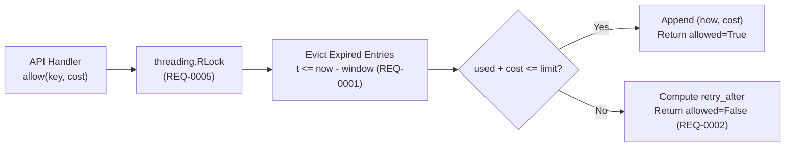

# Technical Design: Sliding-Window Rate Limiter

## Context
Public API endpoints experience burst traffic from multi-tenant callers. We require a deterministic, zero-dependency Python reference implementation of the `rate-limiter` capability (`REQ-0001`..`REQ-0006`) that can be embedded in-process or wrapped behind a distributed Redis adapter.

## Architecture & Data Model

- **State Representation**: Each `key` maps to a `collections.deque[tuple[float, int]]` storing `(timestamp, cost)` pairs in chronological order.
- **Amortized Complexity**: Expired entries sit at the head of the `deque` and are popped in $O(1)$ amortized time via `popleft()`.

## Architecture Decision Records
- [ADR-0001: Storage Engine Selection](./ADR-0001-storage-engine.md)
- [ADR-0002: Rate-Limiting Window Algorithm](./ADR-0002-sync-protocol.md)
