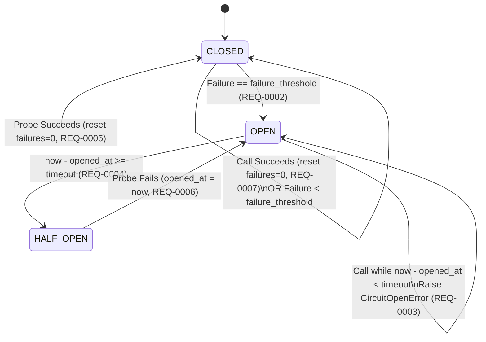

# Technical Design: Circuit Breaker State Machine

## State Transition Diagram

## Concurrency & Determinism
- Protected by `threading.RLock`.
- Accepts injectable `clock: Callable[[], float] = time.monotonic`.
