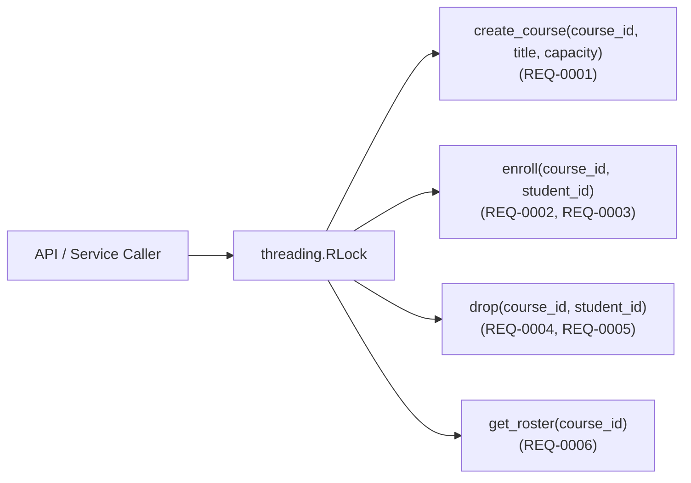

# SPEC.md — CoursePulse Enrollment & Waitlist Service (Single Source of Truth)

## 1. System Overview & Domain Intent
`CoursePulse` is a deterministic, thread-safe university course enrollment and FIFO waitlist management engine. It enforces strict seat capacity limits, automatic waitlist promotion when enrolled students drop a course, idempotent duplicate request handling, and course roster snapshots.

## 2. Architecture & Data Flow



## 3. Data Models & Schemas
All domain value objects use immutable `@dataclass(frozen=True)`:
- `EnrollmentStatus(str, Enum)`:
  - `ENROLLED = "ENROLLED"`
  - `WAITLISTED = "WAITLISTED"`
  - `DROPPED = "DROPPED"`
  - `NOT_FOUND = "NOT_FOUND"`
- `EnrollmentResult(course_id: str, student_id: str, status: EnrollmentStatus, waitlist_position: Optional[int] = None)`
- `DropResult(course_id: str, dropped_student_id: str, status: EnrollmentStatus, promoted_student_id: Optional[str] = None)`
- `CourseRoster(course_id: str, title: str, capacity: int, enrolled: tuple[str, ...], waitlist: tuple[str, ...])`

## 4. Interface & API Contracts (`CoursePulseService`)
- `create_course(course_id: str, title: str, capacity: int) -> CourseRoster`
- `enroll(course_id: str, student_id: str) -> EnrollmentResult`
- `drop(course_id: str, student_id: str) -> DropResult`
- `get_roster(course_id: str) -> CourseRoster`

## 5. Behavioral Workflows & Normative Requirements
- **REQ-0001 (Course Creation & Validation)**: `create_course` SHALL validate non-empty `course_id`, non-empty `title`, and `capacity >= 1` (`ValueError` otherwise). Creating a duplicate `course_id` SHALL raise `ValueError`.
- **REQ-0002 (Seat Allocation & Waitlist Overflow)**: `enroll(course_id, student_id)` SHALL raise `KeyError` if `course_id` does not exist and `ValueError` if `student_id` is empty. If `len(enrolled) < capacity`, the student SHALL be added to `enrolled` and return `EnrollmentResult(..., status=EnrollmentStatus.ENROLLED, waitlist_position=None)`. Otherwise, the student SHALL be appended to the FIFO `waitlist` and return `EnrollmentResult(..., status=EnrollmentStatus.WAITLISTED, waitlist_position=<1-based-index>)`.
- **REQ-0003 (Idempotent Duplicate Enrollment)**: Calling `enroll(course_id, student_id)` for an already-enrolled student SHALL return `status=EnrollmentStatus.ENROLLED, waitlist_position=None` without duplicating the seat. Calling `enroll` for an already-waitlisted student SHALL return `status=EnrollmentStatus.WAITLISTED` with their current 1-based `waitlist_position` without changing queue order.
- **REQ-0004 (FIFO Waitlist Promotion on Enrolled Drop)**: When an `ENROLLED` student calls `drop(course_id, student_id)`, the student SHALL be removed from `enrolled`. If `waitlist` is non-empty, the first student in `waitlist` (`index 0`) SHALL be atomically popped and added to `enrolled`, and `DropResult` SHALL return `status=EnrollmentStatus.DROPPED, promoted_student_id=<promoted_id>`.
- **REQ-0005 (Waitlist Removal & Non-Member Drop)**: When a `WAITLISTED` student calls `drop(course_id, student_id)`, they SHALL be removed from `waitlist` with `status=EnrollmentStatus.DROPPED, promoted_student_id=None`. When a student not in `enrolled` or `waitlist` calls `drop`, the service SHALL return `status=EnrollmentStatus.NOT_FOUND, promoted_student_id=None`.
- **REQ-0006 (Immutable Roster Snapshot & Concurrency)**: `get_roster(course_id)` SHALL raise `KeyError` if `course_id` does not exist and return an immutable `CourseRoster` with `enrolled` and `waitlist` as `tuple[str, ...]`. All methods SHALL be synchronized with `threading.RLock`.

## 6. Repository Structure
```text
clean_room_build/
├── coursepulse.py                  # Core domain implementation
└── adversarial_tests/
    └── test_rebuild_contract.py    # Read-only adversarial contract test suite
```

## 7. Parameterized Deployment & Runtime Config
- Runtime: Python `${PYTHON_VERSION:-3.11}` Standard Library only.
- Default Capacity Parameter: `${DEFAULT_COURSE_CAPACITY:-30}`.

## 8. 3-Phase Rebuild Recipe & Acceptance Criteria
1. **Phase A (Data Models & Exceptions)**: Implement `EnrollmentStatus`, `EnrollmentResult`, `DropResult`, and `CourseRoster` dataclasses in `coursepulse.py`.
2. **Phase B (Core Service & FIFO Waitlist Engine)**: Implement `CoursePulseService` with `threading.RLock` and `collections.deque` waitlist management.
3. **Phase C (Adversarial Clean-Room Verification)**: Lock `adversarial_tests/` read-only (`chmod -R a-w`) and run `python3 -m unittest discover -s adversarial_tests -p "test_*.py" -v`. All 6 requirement tests (`test_req0001_*` .. `test_req0006_*`) MUST pass with zero modifications to the test files.
