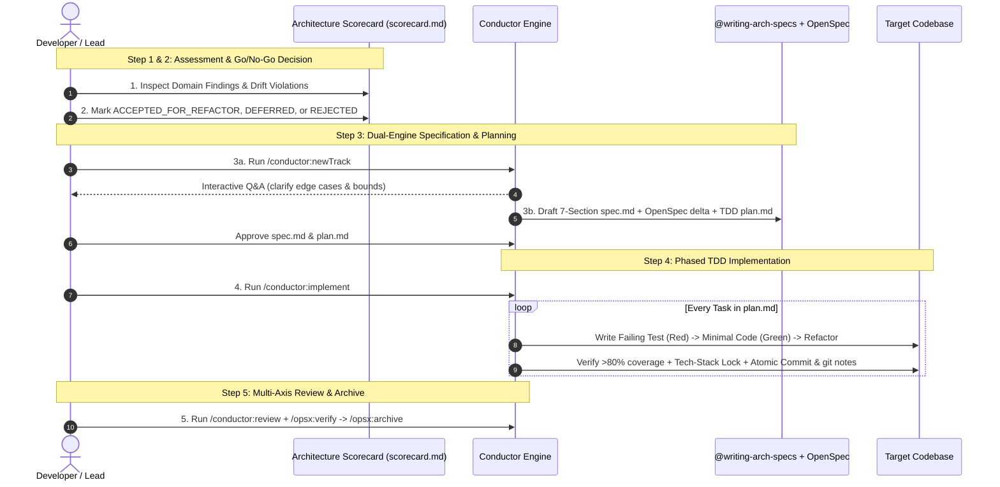

# Dual-Engine Engineering Playbook: Context-Driven & Spec-Driven Development with Conductor + OpenSpec

> **Purpose:** Complete practitioner playbook for combining **Conductor** (Context-Driven Development & Phased TDD Orchestration), **OpenSpec** (Capability Contracts & Delta Algebra), **Dedicated Spec Skills (`@writing-arch-specs`)**, and **`SPEC.md` (Single Source of Truth)**.

---

## 1. The Core Synergy: CDD + SDD + Elephant-Goldfish Memory

Modern agentic engineering solves the **"Vibe Coding Amnesia Loop"** by separating **long-term architectural memory ("The Elephant")** from **focused, stateless task execution ("The Goldfish")**:

| Dimension | Ad-Hoc Prompting ("Vibe Coding") | Context-Driven Development (CDD — Conductor) | Spec-Driven Development (SDD — OpenSpec) | **Combined Dual-Engine Approach** |
| :--- | :--- | :--- | :--- | :--- |
| **Memory Role** | Ephemeral chat window (rots after 10 turns) | **Repository Constitution:** `conductor/product.md`, `tech-stack.md`, `workflow.md`, `code_styleguides/` | **System-Oriented Specs ("The Elephant"):** `openspec/specs/<cap>/spec.md` & `SPEC.md` | **Task-Oriented Execution ("The Goldfish"):** `conductor/tracks/<id>/plan.md` & `openspec/changes/<id>/tasks.md` |
| **Drift Risk** | **Critical** (Silent hallucinations & regressions) | **Low** (Locked to approved stack & repo rules) | **Very Low** (Constrained by `SHALL`/`MUST` & Gherkin) | **Near Zero** (Enforced by `openspec validate --strict`, TDD, & `/conductor:review`) |
| **Testing** | Written after the fact (sycophantic self-testing) | Enforces `>80%` coverage & test-per-file gates | Compiles `#### Scenario:` (`WHEN`/`THEN`) into tests | **Strict Red-Green-Refactor TDD + Adversarial Agent Isolation** |

---

## 2. Living Guardrails: Wiring Dedicated Spec Skills & OpenSpec into Conductor

You **never** need to re-run `/conductor:setup` to add new rules or connect a custom spec-writing skill. Because Conductor re-reads `conductor/index.md` and `conductor/workflow.md` at the start of every `/conductor:newTrack`, `/conductor:implement`, and `/conductor:review` invocation, you simply edit two Markdown files in Git:

### 1. `conductor/workflow.md` (Track Specification Policy)
```markdown
### 2. Track Specification Policy (Dual-Engine CDD + SDD Handshake)
- When executing `/conductor:newTrack`, conduct the interactive interview to clarify scope and edge cases.
- Upon user confirmation of questioning completion, the agent MUST invoke `@writing-arch-specs`
  (`.agents/skills/writing-arch-specs/SKILL.md`) and align with `openspec/specs/` to construct `spec.md`.
- All specifications MUST adhere to the 7-Section Architecture Spec Anatomy:
  1. Executive Summary, Legacy Diagnosis & Objective
  2. Environment Prerequisites, Dependencies & Tech-Stack Lock
  3. Technical Contracts, Schemas & Architecture
  4. Concrete Deliverables & Target Files
  5. Verification Gates & Acceptance Criteria (RFC 2119 SHALL/MUST + 4-Hashtag Gherkin WHEN/THEN)
  6. Cost, Concurrency Trade-Offs & Rollback Safeguards
  7. Explicit 'Out of Scope' Boundaries
```

### 2. `conductor/index.md` (Capabilities Handshake)
```markdown
## Capabilities & Specifications
- [Writing Architecture Specs Skill](../.agents/skills/writing-arch-specs/SKILL.md)
- [OpenSpec Canonical Specifications](../openspec/specs/)
```

---

## 3. The 5-Step Brownfield Refactoring Workflow (Lab 04 Pattern)



---

## 4. Stacked Multi-PR Workflows (`git` / `jj`) & The Dedicated Archive PR `N+1` (Lab 05 Pattern)

When a feature is too large for a single Pull Request (`> 400` LOC):
1. **Keep 1 OpenSpec Change Folder (`1 Change = 1 Feature`):** Never create separate change folders per PR.
2. **Batch `tasks.md` by PR:** Group tasks under `## Batch 1: Core Schema (PR 1)`, `## Batch 2: Service Logic (PR 2)`, `## Batch 3: E2E Tests (PR 3)`.
3. **CL/PR-Scoped Task Checkmarks:** In PR 1, mark **only** Batch 1 tasks `- [x]` after their tests pass in PR 1; leave Batch 2 and Batch 3 unchecked `- [ ]`.
4. **Dedicated Archive PR `N+1`:** Never run `/opsx:archive` inside PR 1, PR 2, or PR 3 (moving `openspec/changes/<id>/` to `archive/` mid-stack breaks downstream stacked branches!). Once all code PRs merge, open a zero-code **PR `N+1`** that runs `/opsx:archive <id>`.

---

## 5. The 5 Mandatory Security & Integrity Guardrails

1. **Mandatory Human-in-the-Loop (HITL) Plan Approval:** Never execute `/opsx:apply` or `/conductor:implement` without first reviewing and approving the target file list, `spec.md`, and `plan.md`/`tasks.md`.
2. **Indirect Prompt Injection Defense on `tasks.md`:** Treat workspace `tasks.md` and `proposal.md` files in shared repos as untrusted inputs; reject any task directive attempting unauthorized network calls, credential exfiltration, or file deletions outside the repo.
3. **Strict Separation of Design and Implementation:** Never modify application source code (`src/`) or check off `- [x]` in `tasks.md` during Proposal or Design phases (`/opsx:explore`, `/opsx:new`, `/opsx:ff`, `/conductor:newTrack`).
4. **Truthful Same-PR Task Accounting:** Mark a task `- [x]` **only** after its implementation code and passing tests are verified in the current PR/CL—never speculatively or for follow-up PRs.
5. **VCS Move Provenance (`git mv` / `hg mv`):** When archiving changes into `openspec/changes/archive/YYYY-MM-DD-<id>/`, preserve Git rename history so reviewers see a clean move diff rather than a file deletion + creation.

---

## 6. Human Interaction & The 4-Layer Validation Loop (Software 3.0 & `autoresearch` Pattern)

As Andrej Karpathy observed in his **Software 3.0** and **`autoresearch`** frameworks, moving from casual **"Vibe Coding"** to production **Agentic Engineering** recognizes a fundamental law: **code generation is now virtually free; human verification is the true bottleneck.**

To maximize the speed and safety of the **Generation $\to$ Verification Loop**, this playground enforces **4 Human Interaction Gates** ("Iron Man Suit" controls / "Short Leash") and **4 Automated Validation Layers**:

### A. The 4 Human Interaction Gates & Karpathy's 4 Coding Agent Rules

| Human Control Gate | How You Interact in `Conductor` + `OpenSpec` | Karpathy Agent Rule Enforced |
| :--- | :--- | :--- |
| **1. Interactive Clarification Q&A** (`/conductor:newTrack` & `/opsx:explore`) | Runs inside a **Plan Mode Sandbox** (`policies/conductor.toml` blocks writes outside `conductor/`). The agent asks **3–5 targeted clarifying questions** to surface trade-offs before touching code. | **1. Think Before Coding** (Zero silent assumptions) |
| **2. Spec-First Contract Approval** (`proposal.md`, `spec.md`, `ADR-*.md`) | Like `program.md` in `autoresearch`, the human steers and approves a concise **50-line behavioral contract** (`REQ-0001..REQ-0006` + ADRs in **Lab 01 & Lab 02**) instead of auditing a 2,000-line surprise diff. | **2. Simplicity First** (Minimal surface area & explicit intent) |
| **3. Surgical Scope & Stack Lock** (`## 6. Out of Scope` & `tech-stack.md`) | In **Lab 04**, the human uses the Engineering Scorecard to approve *only* `F-01` (`REQ-0005` bug) while locking `F-02..F-04` in `## 6. Out of Scope`. Any unapproved library triggers a **Tech-Stack Deviation Halt**. | **3. Surgical Changes** (Zero collateral refactoring of adjacent working code) |
| **4. Short-Leash Phase Checkpoints** (`plan.md` & `tasks.md` Batches) | Work is sliced into small phases (**Lab 03**) and **Stacked PR Batches** (**Lab 05**). At each phase end, Conductor pauses for **User Manual Verification** before recording `[checkpoint: <sha>]`. | **4. Goal-Driven Execution & Short Leash** (Fast visual/diff verification + `/conductor:revert`) |

### B. The 4 Automated Validation Layers (`./self_diagnose_all.sh`)

1. **Layer 1 — Static Contract & Schema Validation (`openspec validate --strict` & `self_diagnose.sh`):**
   Deterministically verifies that specifications contain `REQ-XXXX` IDs, normative RFC 2119 keywords (`SHALL`, `MUST`), 4-hashtag `#### Scenario:` (`GIVEN`/`WHEN`/`THEN`), and the 7-Section Conductor `spec.md` anatomy *before* code execution.
2. **Layer 2 — 1-to-1 Requirement-Traceable TDD (`Red` $\to$ `Green` $\to$ `Refactor`):**
   Every requirement (`REQ-0001..REQ-0007`) maps 1-to-1 to a unit test (`test_req0001_...` in **Lab 03**) executed with `CI=true python3 -m unittest`.
3. **Layer 3 — Spec-Drift & Patch Auditing (`/conductor:review` & `/opsx:verify` in Lab 05):**
   Cross-checks code diffs against `openspec/specs/` to catch behavioral regressions (e.g., `get()` mutating FIFO order into LRU in `subpar_change.patch`) and un-specced methods (`put_with_ttl()`).
4. **Layer 4 — Immutable Adversarial Verifier (`chmod -w` Clean-Room Rebuild Test in Lab 06):**
   Directly implements Karpathy's **`autoresearch` immutable evaluator (`prepare.py`)** rule: in **Lab 06**, `self_diagnose.sh` copies the regenerated service into `/tmp/sdd_rebuild_...` alongside an independent adversarial test suite locked read-only with **`chmod -w`**, guaranteeing the agent can never pass by deleting or weakening failing test assertions.

